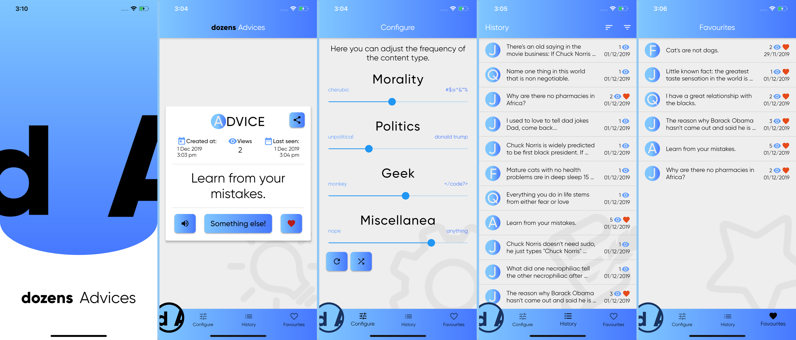

# dozens Advices

 

Flutter application based on the architecture of the [Bloc Library](https://bloclibrary.dev/#/). 
The app is an aggregator of jokes, advices, quotes and facts. 
User able to adjust the frequency of content genres. 
For example, you can configure the application to receive black humor and jokes about programming, while excluding content related to politics.

### List of open-APIs which were implemented in dozens Advices app:

* [Official Joke API](https://github.com/15Dkatz/official_joke_api)
* [Breaking Bad quotes API](https://github.com/shevabam/breaking-bad-quotes)
* [Cat Facts](https://github.com/alexwohlbruck/cat-facts)
* [CHUCKNORRIS.IO](https://github.com/chucknorris-io/chuck-api)
* [forismatic.com](http://forismatic.com)
* [The Internet Chuck Norris Database](http://www.icndb.com)
* [kanye.rest](https://github.com/ajzbc/kanye.rest)
* [NUMBERS API](http://numbersapi.com)
* [Ron Swanson quotes API](https://github.com/jamesseanwright/ron-swanson-quotes)
* [Advice Slip](https://adviceslip.com)
* [Star Wars Quote API](http://swquotes.digitaljedi.dk/home)
* [JokeAPI by Sv443](https://github.com/Sv443/JokeAPI)
* [TRONALDDUMP.IO](https://github.com/tronalddump-io/tronald-app)
* [What does Trump think?](https://whatdoestrumpthink.com)
* [Random Useless Facts](https://uselessfacts.jsph.pl)

